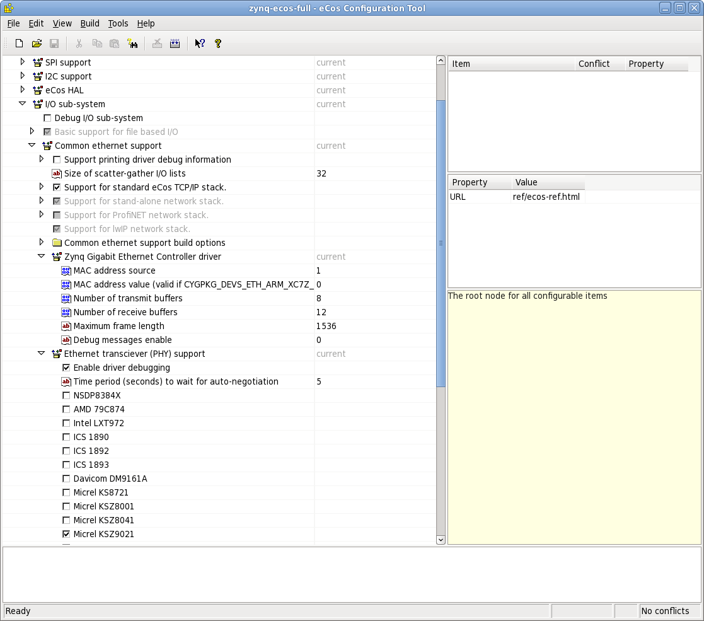

Introduction
============

This is a port of the eCos 3.0 real-time operating system for `Enclustra's Mars ZX3 Zynq module <http://www.enclustra.com/en/products/system-on-chip-modules/mars-zx3/>`_.

ECos
----

ECos is a configurable real-time operating system intended for use in embedded applications. The documentation for eCos 3.0, which is the most recent version of the system as well as the one ported to Mars ZX3, can be found at http://ecos.sourceware.org/docs-3.0/.

This document
-------------

For the most part, this document describes features specific to the Mars ZX3 port, however it also contains some information which do not directly refer to the port but may be helpful in working with the system. 

Acknowledgements
----------------

We would like to thank Enclustra GmbH (http://enclustra.com) for co-sponsoring the port as well as Richard Rauch (http://www.itrgmbh.de) for his help in the porting effort.

The remarks of Garry Jeromson and Christoph Glattfelder of Enclustra GmbH, the manufacturer of the module, have been extremely helpful in making this document more complete and accurate.

Supported features
------------------

This eCos port provides the following software packages specific for Enclustra's Mars ZX3 Zynq module:

* HAL package
* cache support
* debug UART driver
* serial port driver
* Ethernet driver
* I2C driver
* QSPI Flash driver
* RedBoot with Ethernet and Flash support

Version information
-------------------

.. csv-table::
   :header: Author,Content,Date,Version

   Michael Gielda,Draft version,10.09.2012,0.1
   Michael Gielda,Preliminary release,15.09.2012,0.2
   Ziemowit Borowski,First release,25.09.2012,0.3
   Michael Gielda,Corrections; ecc files; appendix,28.09.2012,0.5
   Michael Gielda,Updates for secondary release,10.10.2012,0.6
   Mateusz Majchrzycki,Added section on building a boot image,25.10.2012,0.6.1
   Michael Gielda,Corrections,25.10.2012,0.6.2
   Karol Gugala,Minor Updates,10.01.2013,0.6.3
   Michael Gielda,Updates to feature test feedback,11.01.2013,0.7
   Michael Gielda,Fixes for readthedocs,18.04.2013,0.7.1

Compiling the system
====================

The port was prepared using Gentoo, Debian and Ubuntu Linux environments. The procedures described here should also work on other systems, but if you detect any errors or ommissions please e-mail us at contact@antmicro.com.

.. _prerequisites:

Prerequisites 
-------------

Toolchain
~~~~~~~~~

The toolchain used to compile the port is Sourcery G++ Lite 2011.03-42, and can be obtained from `the Mentor Graphics website <https://sourcery.mentor.com/sgpp/lite/arm/portal/release1802>`_.

It should be decompressed so that its :file:`bin` directory is included in the PATH variable.
The proper availability of the toolchain can be checked by finding out if ``arm-none-eabi-gcc`` is available from the shell.

``ecosconfig``
~~~~~~~~~~~~~~

The ``ecosconfig`` tool, available from the `eCosCentric website <http://www.ecoscentric.com/snapshots/ecosconfig-100305.bz2>`_, is used to generate the build tree from the main repository and is a mandatory requirement.
``ecosconfig`` requires the tcl compiler to work. For Debian or Ubuntu development platforms the proper package is named ``tcl8.5``, you can install it using: ``sudo apt-get install tcl8.5``.
For Gentoo platforms the package is named ``dev-lang/tcl``, you can install it using: ``sudo emerge dev-lang/tcl``.

``configtool`` (optional)
~~~~~~~~~~~~~~~~~~~~~~~~~

``configtool`` is an optional GUI tool to facilitate the creation of eCos configuration tools files. It also may be downloaded from `eCosCentric <http://www.ecoscentric.com/snapshots/configtool-100305.bz2>`_.

.. warning::

   ``ecosconfig`` and ``configtool`` are 32bit applications, thus if you are using a 64bit OS you have to provide 32bit run-time libraries for compatibility. In a Ubuntu/Debian OS these could be installed using the command ``sudo apt-get install ia32-libs``.

Source code and configuration files
-----------------------------------

The source of the port is provided with this manual, in a separate :file:`src.tar.bz2` file. 

By default, two general purpose configuration files are provided with the relese. See :ref:`ready-made` for details.

Eventually all the files mentioned above will be made available online.

Building eCos
-------------

Using ``ecosconfig``
~~~~~~~~~~~~~~~~~~~~

The main tool used for building the eCos operating system is ``ecosconfig`` (see :ref:`prerequisites`).
The source tree of eCos, called **eCos repository** (like for example the source code tree provided in this release) is not built directly but instead first trimmed down and configured to suit the needs of a specific user and platform using ``ecosconfig``.
This static pick-and-build procedure allows the user to exclude these elements of the system which are not necessary, thus reducing the memory footprint.
This mechanism also enables easy configuration of system-wide variables and driver specific features.

What exactly can be included, excluded or configured is determined by the contents of :file:`.cdl` files residing side by side with all source files in the eCos repository (usually in the :file:`cdl` directory on the same level as the :file:`src` directory of a given package, like a driver for a particular interface).

Package list
~~~~~~~~~~~~

The available packages which can be used in configuring eCos for Mars ZX3  are provided below, together with explanations which is responsible for what:

* ``CYGPKG_HAL_ARM_XC7Z`` - Xilinx Zynq 70XX series specific infrastructure
* ``CYGPKG_HAL_ARM_XC7Z020`` - Xilinx Zynq 7020 EPP specific infrastructure
* ``CYGPKG_HAL_ARM_MARS_ZX3`` - Enclustra Mars ZX3 module specific infrastructure
* ``CYGPKG_DEVS_ETH_ARM_XC7Z`` - Xilinx Zynq Ethernet (Cadence GEM) driver
* ``CYGPKG_DEVS_I2C_ARM_XC7Z`` - Xilinx Zynq I2C (XIIC) driver
* ``CYGPKG_IO_SERIAL_ARM_XC7Z`` - Xilinx Zynq serial port driver
* ``CYGPKG_DEVS_QSPI_ARM_XC7Z`` - Xilinx Zynq QSPI driver
* ``CYGPKG_DEVS_FLASH_SPI_M25PXX`` - M25P Flash driver modified to support Winbond W25Q series Flash memories.

``.ecc`` files
~~~~~~~~~~~~~~

The output of ``ecosconfig`` are :file:`.ecc` (**eC**\ os **C**\ onfiguration) files which are in essence ``tcl`` scripts storing all the information on what elements will be included in the system image and how they will be configured.
A `handbook on ecosconfig <http://ecos.sourceware.org/docs-3.0/user-guide/using-ecosconfig-on-linux.html>`_ exists to help in the manual creation of :file:`ecc` files.

While creating :file:`.ecc` files from scratch is possible, there exist several methods of making the process much simpler.

Templates and configtool
~~~~~~~~~~~~~~~~~~~~~~~~

``configtool`` (see :ref:`prerequisites`) allows the user to build the system however they want using a graphical user interface, provided constraints in :file:`.cdl` files describing the system structure are maintained.

While creating a new :file:`.ecc` file it is easier to also use a predefined template representing common use scenarios, such as **posix** which represents a system which has all the necessary packages to run typical POSIX programs or **redboot** which understandably is used to build a binary of RedBoot, the eCos bootloader.

The supported templates are:

* default
* minimal
* all
* kernel
* lwip_net
* net
* posix
* redboot

.. _configtool-phy:

   Configtool showing some of ZX3 specific options, such as the Micrel PHY

In order to select a template to base upon, use :menuselection:`build -> templates`. The necessary packages can be added from :menuselection:`build -> packages`.

.. warning::

   Remember that the templates are just general scenarios, which may contain settings incompatible with the desired ones (baudrates, console mangling, debug console choice, presence of RedBoot ROM monitor). It is necessary to tweak them according to your needs. If you want to use a network connection through the ``Zynq Gigabit Ethernet Controller`` you have to enable at least one ``Ethernet tranceiver (PHY) support`` as presented in the figure entitled :ref:`configtool-phy`

.. _ready-made:

Ready-made ``.ecc`` files
~~~~~~~~~~~~~~~~~~~~~~~~~

Two ready-made :file:`.ecc` files will be provided with this distribution.
The first one, :file:`mars_zx3_ecos.ecc`, results in building the eCos kernel.
The other, :file:`mars_zx3_redboot.ecc`, can be used to build RedBoot (see :ref:`redboot`).

.. _build-kernel:

Building the kernel
~~~~~~~~~~~~~~~~~~~

Provided an :file:`.ecc` file is generated properly (or supplied from outside), eCos can now be compiled to include all the elements and options as selected in the file.
A short shell script is proposed to make the compilation process easier:

.. topic:: Making the eCos kernel script.

   .. code-block:: bash

      export ECOS_REPOSITORY="{path/to/repository}/packages"
      export PATH="$PATH:{path/to/toolchain}/bin"

      mkdir -p build
      rm -rf build/*
      cd build

      ../ecosconfig --config=../mars_zx3_ecos.ecc tree
      make

The resulting kernel files can be found in :file:`build/install/lib`.

.. _build-tests:

Building tests
~~~~~~~~~~~~~~

The system features a testing mechanism where particular drivers and system abstractions can be checked for proper functioning.

The tests reside in the respective directories, for example :file:`devs/i2c/arm/xc7z/current/tests/i2ctest.c` (the test that can be used to check if I2C runs properly - see :ref:`i2ctest`).

Building all tests is very simple, it is enough to use ``make tests`` instead of ``make`` in a procedure like the one above. 
The compiled test binaries reside in the respective directories, like :file:`build/install/tests/devs/i2c/arm/xc7z/current/tests/i2ctest`

.. warning::

   Remember that tests are built only if the corresponding setting is enabled in the :file:`.ecc` used file. 
   Tests cannot be generated for the *redboot* template, as they are in essence eCos applications. 

.. _build-application:
   
Building an eCos application
~~~~~~~~~~~~~~~~~~~~~~~~~~~~

With a compiled kernel files in the :file:`build/install/lib` directory (see :ref:`build-kernel`), a user space eCos application can be compiled and linked to it.

.. topic:: Building user space application script.

   .. code-block:: bash

      # Set paths.
      KPATH="/path/to/kernel/build/directory"   # modify this
      TPATH="/path/to/toolchain/bin/directory"  # modify this

      # Set compiler path.
      export PATH=#{TPATH}:${PATH}

      # Application source code.
      FILES="file1.c file2.c file3.c"

      # Set compiler options.
      OPT="-mcpu=cortex-a9 -Wpointer-arith -Winline -Wundef -g -O2 \
           -nostdlib -ffunction-sections -fdata-sections -fno-exceptions"

      # Do compilation and link your application with kernel.
      arm-none-eabi-gcc -g -I./ -g -I${KPATH}/install/include ${FILES} \
      -L${KPATH}/install/lib -Ttarget.ld ${OPT}

.. _redboot:
   
RedBoot
=======

RedBoot is the eCos bootloader that shares the driver infrastructure with eCos. It is, however, not limited to booting eCos and can just as well work as a standalone bootloader for other types of binaries. It has several interesting functionalities, such as support for Ethernet and SPI Flash.

Building RedBoot
----------------

To build RedBoot, prepare an :file:`.ecc` based on the RedBoot template and build as normal (see :ref:`build-kernel`). A RedBoot binary (in the ELF format) will reside in :file:`build/install/bin/redboot.elf`. 

.. warning::

   If you built your system using the RedBoot template from scratch (not using an :file:`.ecc` file) and use the none-eabi compiler like the one suggested in this manual, you need to set the ``-fno-builtin`` compiler option.
   Otherwise a runtime error occurs.

Ethernet support in RedBoot
---------------------------

Ethernet in RedBoot can be used to download and run files on the ZX3 board, ping it or telnet to it. Remote boot via tftp is possible.
A blog note will be written on use of Ethernet in RedBoot on Enclustra Mars ZX3.

By default, the board will use DHCP to acquire the IP address, this is however fully configurable before compiling the system as well as at runtime.

.. warning::

   If you plug in the Ethernet cable after the system is booted, you will not be able to receive data until some data is sent first and the linkup can be detected. This is because RedBoot does not support interrupts.

IP setting in ``.ecc``
~~~~~~~~~~~~~~~~~~~~~~

The IP address of the board can be set using the value :menuselection:`Redboot ROM monitor --> Build redboot ROM ELF image --> Redboot Networking --> Default IP address` in ``configtool``.

If DHCP is to be used, select :menuselection:`Use DHCP to get IP information`; otherwise uncheck it.

Also :menuselection:`Use a gateway fot non-local IP traffic --> Default gateway IP address` and :menuselection:`Use a gateway fot non-local IP traffic --> Default IP address mask` may be of interest.

IP setting at runtime
~~~~~~~~~~~~~~~~~~~~~

The following commands can be used to manipulate the IP address at runtime:

* ``ip_address -l <local_addr>`` - set static IP address
* ``ip_address -h <server_address>`` - set the IP address of the server to boot from
* ``ip_address -b`` - get IP address from DHCP

SPI Flash support in RedBoot
----------------------------

A Flash Image System (FIS) can be created with RedBoot and subsequently modified. RedBoot can perform self-modification, put ELF files there and run them, etc.
A blog note will be written on use of Flash in RedBoot on Enclustra Mars ZX3.

Usage
=====

After building a eCos kernel (see :ref:`build-kernel`), a user application must be linked against it to produce a runnable program (see :ref:`build-application`). The program can be directly uploaded to the module (see :ref:`loading`) or included in a boot image file (see :ref:`build-boot`).

.. _build-boot:

Building a boot image file
--------------------------

The boot image is the file which is used to program the Flash memory on the Mars ZX3 module. The boot image contains the FSBL (First Stage Bootloader), the SLCR configuration data for the Zynq EPP, the bitstream for the PL and the user application or the Second Stage Bootloader. Only the FSBL is required to create the boot image. Other components are optional.
The boot image file is built with the ``bootgen`` tool from the Xilinx Design Suite. To create the image, a simple text file in the :file:`.bif` format, containing a list of files used in the process, is needed. An example :file:`.bif` file is presented below:

.. code-block:: c

   the_ROM_image:
   {
       [bootloader]fsbl.elf
       system_top.bit
       redboot.elf
   }

The filenames used in the :file:`.bif` file may also contain an absolute path if they are located in another directory than the :file:`.bif` file. Next, ``bootgen`` should be used to build the boot image:

.. code-block:: bash
    
   bootgen -image bootimage.bif -o i output.bin
        
After the boot image is created, it may be uploaded to the Mars ZX3 module using the ``Enclustra MCT`` software.
Further details about the process of creating a boot image can be found in the `Zynq-7000 EPP Software Developers Guide <http://www.xilinx.com/support/documentation/user_guides/ug821-zynq-7000-swdg.pdf>`_ on page 29.

.. _loading:

Loading binaries to the module
------------------------------

Binaries can be loaded to the ZX3 module using a Xilinx JTAG, ``xmd`` and ``gdb``. A non-Xilinx JTAG with openocd can also be used; this will be the subject of an upcoming blog note in the Zynq series.
What follows is a simple procedure that can be used to run a precompiled binary on the ZX3 module.

.. note::

   The special ``gdb`` commands were removed since the primary release as they are no longer needed, and thus the procedure does not differ from uploading binaries to any other board.

#. Run ``xmd`` and ``gdb`` in separate terminals.
#. Connect to the board with ``xmd`` using ``connect arm hw``.
#. Upload the binary with ``gdb`` using the commands ``load [elf filename]`` and ``c`` (continue).

QSPI Test
---------

The W25Q QSPI Flash test contains a test case repeatedly erasing and filling the onboard Winbond W25Q QSPI Flash with a checkerboard and inverse checkerboard of 0xAA and 0x55.
It is based on a test for a similar, very popular model of Flash memory, the M25Q, which is part of the eCos mainline (:file:`packages/devs/flash/spi/m25pxx/test/m25pxx_test.c`). 

Since the Flash on board of the ZX3 module contains a bitstream and FSBL, which need an external program to replace, the test does not modify the part of the Flash (memory addresses under 0x00400000). This is a feature peculiar to this platform which would require changes not only to header definitions but in several places inside the test, so the M25P test was not modified and instead a :file:`w25qxx_test.c` file is provided separately with the distribution.

The file can be compiled as a user-space eCos program linked against a kernel with Flash support (i.e. a kernel built with ``CYGPKG_IO_FLASH`` in the cdl_configuration part on the top of the :file:`ecc` file). The compilation procedure for a user-space application can be found in :ref:`build-application`. 

This is a good way to test such a compilation procedure, however, for convenience, a binary of the test (:file:`w25qxx_test`) is also included in the package.

.. _i2ctest:

I2C Test
--------

The test mimicks the functioning of the Xilinx BSP-based test provided for the ZX3 module by Enclustra, i.e. communicates with the on-board EEPROM to read module data and then tests the RTC, both of which reside on the module and are connected to the I2C bus.
The test is part of the standard eCos test suite and will be built using the procedure described in :ref:`build-tests` for any :file:`.ecc` which includes the I2C package (``CYGPKG_IO_I2C``).

Appendix 1: Clock speeds
========================

The default CPU clock frequency on the MARS ZX3 board is 400MHz. The RTC system timer is clocked by CPU frequency divided by 4. The required timer interrupt period is 1ms.
System initialization parameters are set as described above in:
:file:`packages/hal/xc7z/var/current/cdl/hal_arm_xc7z.cdl`:

.. topic:: Clock settings

    .. code-block:: tcl

        cdl_option CYGHWR_HAL_ARM_SOC_PROCESSOR_CLOCK {
            display       "Processor clock rate"
            flavor        data
            default_value 400000000
            description   "
               The processor can run at various frequencies.
               These values are expressed in Hz. It's the CPU frequency."
        }

        cdl_component CYGNUM_HAL_RTC_CONSTANTS {
            display       "Real-time clock constants"
            flavor        none

            cdl_option CYGNUM_HAL_RTC_NUMERATOR {
                display       "Real-time clock numerator"
                flavor        data
                default_value 1000000000
            }
            cdl_option CYGNUM_HAL_RTC_DENOMINATOR {
                display       "Real-time clock denominator"
                flavor        data
                default_value 1000
            }
            cdl_option CYGNUM_HAL_RTC_CPU_CLOCK_DIVIDER {
                display        "Divider of CPU frequency distributed to RTC"
                flavor         data
                default_value  4
            }

            cdl_option CYGNUM_HAL_RTC_PERIOD {
                display       "Real-time clock period"
                flavor        data
                calculated    ((CYGHWR_HAL_ARM_SOC_PROCESSOR_CLOCK/
                                CYGNUM_HAL_RTC_CPU_CLOCK_DIVIDER)/
                                CYGNUM_HAL_RTC_DENOMINATOR)
                description   "Value to program into the RTC clock generator. \
                               OS timer must be 1 ms."
            }
        }

CYGNUM_HAL_RTC_NUMERATOR and CYGNUM_HAL_RTC_DENOMINATOR determine that the timer interrupt period is:

CYGNUM_HAL_RTC_NUMERATOR/CYGNUM_HAL_RTC_DENOMINATOR nanoseconds.

CYGNUM_HAL_RTC_PERIOD is a value written directly to the clock divider to obtain the required interrupt frequency.
It is calculated just like the CPU clock using the CYGHWR_HAL_ARM_SOC_PROCESSOR_CLOCK, CYGNUM_HAL_RTC_CPU_CLOCK_DIVIDER
and CYGNUM_HAL_RTC_DENOMINATOR values.
